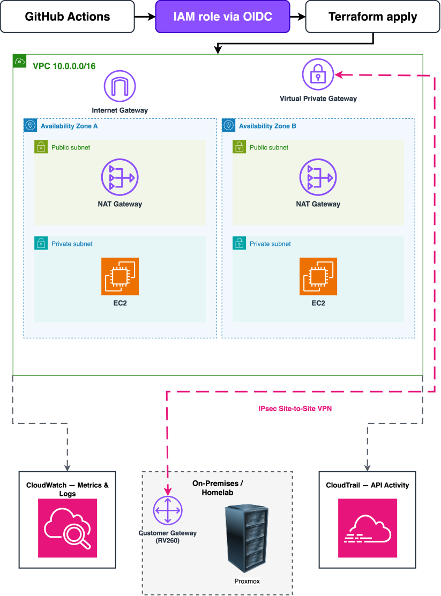

# Enterprise Hybrid AWS Environment 
 
 This is a project that I am building to gain a better understadning of cloud computing mixed with a on Site homelab. The goal of the Project is to mimic enterprise infastrcutre patterns. The project is supplied entirely as Code, deployed through secure CI/CD pipeline,monitored end to end and connected to the homelab. 

## What this demonstrates 

The goal of this project is to replace manual,click-ops cloud set up with the kind of workflow that you would see a team actually run :

Infrastructure as Code -  a multi AZ AWS VPC and core networking, equiped with Terraform insrtead of the console, so the entire environmnet can be reproduced by running one command. 

Secure CI/CD - deployements run through Github Actions using OIDC dfederations so there are no long lived AWS access keys stored anywhere. 

Monitoring & observability - Cloudwatch and CLoudTrail wired in from day one for visbility inot infastrucurture health and account activity. 

Hybrid Networking- the Aws VPC is linked to a real on premises homelab running Proxmox over a site to Site connection so this project expands beyond just a Cloud only sandbox. 

## Architecture 



Multi- AZ VPC Provisioned via Terraform,deployed through GitHub actions Using OIDC, monitored with CloudWatch/CloudTrail and linked to on on prem homelab over a site to site VPN.
 

## Tech Stack 
| Layer | Tool |
|:-------|--------:|
|IAC   |Terraform (1.10+,native S3 state locking)|
|Cloud provivder| AWS |
|CI/CD | GitHub Actions(OIDC auth)|
|Monitoring| CloudWatch,CloudTrail|
|Hybrid link| AWS Site to Site VPN <-> Proxmox Homelab|

## Repository Structure
.
├── modules/
│   ├── network/       # VPC, subnets, route tables, NAT
│   └── compute/       # EC2 instances, SSM access
├── environments/
│   └── dev/           # Environment-specific tfvars and backend config
├── .github/
│   └── workflows/     # CI/CD pipelines (plan on PR, apply on merge)
├── backend.tf
└── README.md

## SetUp 
Deployement Automation is still a working progress this section will be updated as the Terraform modules land. Here is the Planned flow:
```bash
# Prerequisites: Terraform 1.10+, AWS CLI configured, an S3 bucket for state
cd environment/dev
terraform init
terraform plan 
terraform apply
```
## Roadmap
- [x] Repo scafolled with module structure
- [ ] AWS account Hygiene -MFA,IAM Identity Center,billing alerts,CloudTrail 
- [ ] Terraform Remote state backend (S3 native locking)
- [ ]  Multi-AZ VPC module 
- [ ]  GitHub Actions OIDC Pipeline (Plan on PR,apply on merge)
- [ ] Site to Site VPN link to homelab 
- [ ]  Cloudwatch dashboard + alarms 

## Status 
In Progress. This README will be updated as I complete the project and each phase is finish. I will Provide proof of the VPC being live once it is completed with screenshots. 

## License 
MIT


